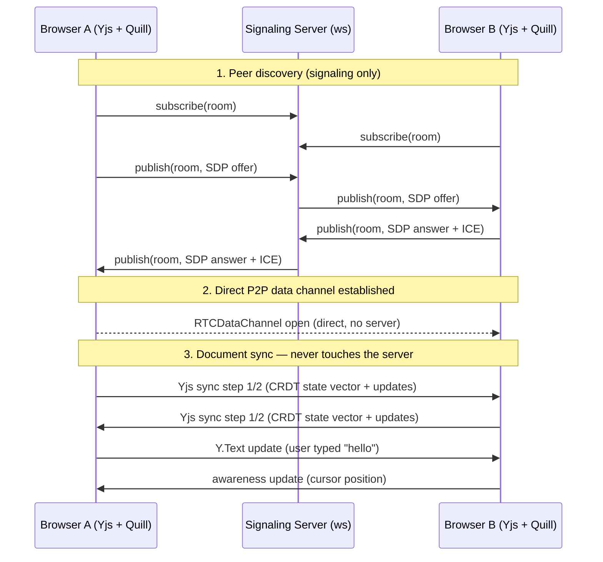
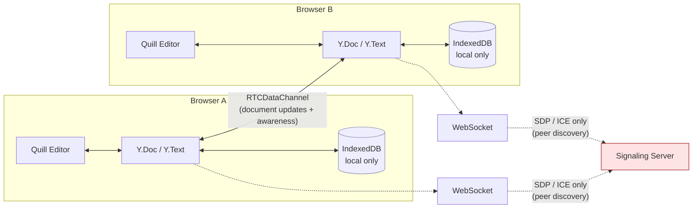

# Architecture — Part 1

## Components

- **Signaling server** (`signaling-server/`): Node.js + `ws`. Only relays WebRTC handshake envelopes (SDP/ICE) between browsers subscribed to the same room topic. Never sees document content. See the large comment block at the top of `signaling-server/server.js` for the detailed boundary argument.
- **Frontend** (`frontend/`): React + Vite app.
  - `Y.Doc` — the CRDT document, one shared `Y.Text` (`quill-content`) per room.
  - `IndexeddbPersistence` (`y-indexeddb`) — local-only browser storage so a refresh doesn't lose unsynced edits. Not distributed; each browser has its own copy.
  - `WebrtcProvider` (`y-webrtc`) — connects to the signaling server for peer discovery, then opens direct `RTCDataChannel`s to other peers in the room using Google STUN for NAT traversal.
  - `QuillBinding` (`y-quill`) — two-way binding between the Quill rich-text editor and the shared `Y.Text`, plus rendering of remote cursors/selections from `awareness` state.
  - Awareness (`provider.awareness`, from `y-protocols/awareness` bundled in `yjs`) — ephemeral (non-CRDT) shared state used for presence (name/color) and live cursor positions.

## Data flow

The dashed lines into the signaling server carry only handshake data. The solid line between the two `Y.Doc`s is the real document traffic, and it never passes through the server.

## Why Yjs/CRDTs avoid needing a central conflict-resolution authority

Traditional collaborative editing (e.g. Operational Transformation) typically needs a server to serialize concurrent edits into a canonical order, because OT operations are defined relative to a specific document version and must be transformed against every operation that happened "in between." That transformation step is what usually gets centralized.

Yjs's `Y.Text` instead uses a CRDT (a variant of the YATA algorithm). Every character insertion is anchored to its immediate left/right neighbor *characters* (not numeric positions), and tagged with a `(clientID, clock)` pair. Because the anchor is a specific character object rather than an index, two peers can insert at "the same place" concurrently and, when each applies both operations (in any order, no coordination required), they deterministically converge on the same final sequence — this is Strong Eventual Consistency. There is no version negotiation, no operation transformation, and no arbitration step, so there is nothing for a central server to do. Any peer that has ever seen an update can safely merge it whenever it arrives.

## Why the signaling server does not violate the "no central authority" claim

"No central authority" here specifically means no central authority over **document state/conflict resolution**. The signaling server has zero role in that — it cannot resolve, order, or even see Yjs operations. Its only function is analogous to a phone book: helping two parties that don't know each other's network address find each other so they can open a direct connection. Once that connection is open:

- Document sync, conflict resolution, and awareness/presence all happen entirely peer-to-peer.
- Killing the signaling server does not affect already-connected peers (see README testing section — this is verified, not assumed).
- The signaling server holds no per-room document state at all; its entire memory footprint is `Map<roomName, Set<socket>>`, which is peer-discovery bookkeeping, not application data.

This is the same architectural pattern used by essentially all serverless WebRTC apps (video calls, file transfer tools, etc.) — a lightweight rendezvous point is not the same thing as a central data authority.

## Known limitations of Part 1 (intentional scope)

- **No TURN server.** STUN-only NAT traversal, as specified. On networks with symmetric NAT / strict firewalls, direct connection can fail; this surfaces as a visible "Connection error" status rather than failing silently, but there's no fallback relay path in Part 1.
- **"Error" status is heuristic**, not a definitive WebRTC failure signal. y-webrtc doesn't expose a single unified "handshake failed" event at the provider level; the app infers an error state if, after ~8s, the signaling socket never connects and no peer connection exists. If you are alone in a room past that timeout, you'll briefly see "Connecting…" flip based on signaling connectivity alone (this is expected and clearly distinct from being connected to a peer).
- **No QR code generation** — a shareable URL/copy-link is provided; QR rendering was not in the required stack and wasn't added to avoid an unrequested new dependency.
- No vector clocks, leader election, or audit log — deliberately out of scope for Part 1 per project instructions.
